# 0. Before We Start: How Does a C Program Become a Running Program?

Before learning pointers, it is useful to understand what happens between writing C code and seeing the program run.

Suppose we write:

```c
#include <stdio.h>

int main(void) {
    printf("Hello\n");
    return 0;
}
```

A simplified build pipeline is:

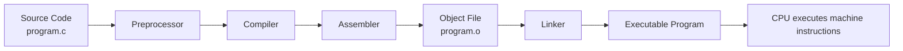

## 0.1 Preprocessor

The preprocessor handles directives such as:

```c
#include <stdio.h>
#define SIZE 10
```

For example:

```c
#include <stdio.h>
```

does not mean that the CPU directly "imports a library" while the program is running.

Before compilation, the preprocessor processes the required declarations and macro-related source transformations.

---

## 0.2 Compiler

The compiler analyzes the C source code and translates it toward machine-level instructions.

During this process it checks things such as:

- syntax,
- type compatibility,
- declared identifiers,
- function signatures,
- expressions,
- many compile-time errors.

For example:

```c
int x = "hello";
```

contains an incompatible assignment and should produce a diagnostic.

The compiler needs to know enough about an identifier **before that identifier is used**.

That leads directly to an important C concept: **function declarations**.

---

## 0.3 Assembler

The compiler may generate assembly code.

The assembler then converts assembly instructions into machine-code instructions stored in an **object file**.

For example:

```text
program.c
   ↓
assembly-like representation
   ↓
program.o
```

---

## 0.4 Linker

Your program may use functions implemented elsewhere.

For example:

```c
printf("Hello\n");
```

You did not write the implementation of `printf`.

The linker connects your compiled object code with the required external compiled code and produces the executable program.

A simplified model:

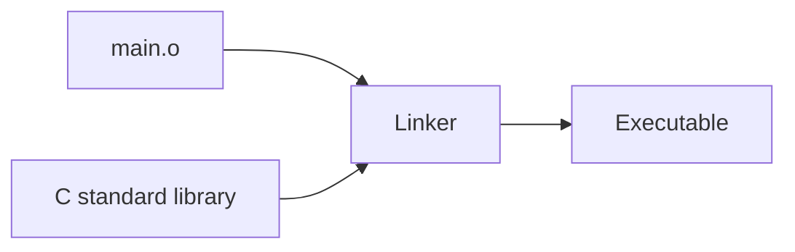

---

## 0.5 Compiler vs Interpreter

A **compiler** generally translates a program into another lower-level representation before execution.

A traditional C workflow produces native machine code.

An **interpreter** typically reads and executes program instructions through another runtime program.

Simplified comparison:

| Compiler-oriented execution | Interpreter-oriented execution |
|---|---|
| Source is translated before normal execution | Runtime reads/evaluates instructions |
| C is traditionally compiled | Python is commonly interpreted through a runtime |
| Native executable may be produced | Usually requires the interpreter/runtime |
| Many errors can be found before execution | Some errors may appear only when execution reaches them |

> [!note] Important
> The real world is more complicated than a strict "compiled vs interpreted" division.
>
> Some languages use bytecode, virtual machines, JIT compilation, or several stages together.
>
> For this course, the important point is that **C is normally compiled into machine code before the resulting program executes**.

---

# Information Note – Why Is a Function Declaration Sometimes Above `main()`?

Consider:

```c
#include <stdio.h>

void hello(void);

int main(void) {
    hello();
    return 0;
}

void hello(void) {
    printf("Hello\n");
}
```

Why do we write:

```c
void hello(void);
```

before `main()`, while the full function body is below `main()`?

Because when the compiler reaches:

```c
hello();
```

it needs to know that `hello` exists and what its type/signature is.

The line:

```c
void hello(void);
```

is a **function declaration**, also called a **function prototype**.

It tells the compiler:

> There is a function named `hello`, it takes no arguments, and it returns `void`.

The implementation can appear later:

```c
void hello(void) {
    printf("Hello\n");
}
```

Another valid solution is to place the entire function definition before `main()`:

```c
void hello(void) {
    printf("Hello\n");
}

int main(void) {
    hello();
}
```

So the rule is not:

> "Functions must always be above `main()`."

The actual idea is:

> **The compiler must see a suitable declaration before the function is used.**

This becomes especially important when programs are separated into `.c` and `.h` files.

---

# Information Note – Declaration vs Definition

These concepts are different.

## Declaration

A declaration introduces information about an identifier.

```c
void swap(int *a, int *b);
```

This tells the compiler the function's name, parameter types, and return type.

## Definition

A definition provides the actual implementation:

```c
void swap(int *a, int *b) {
    int temp = *a;
    *a = *b;
    *b = temp;
}
```

For variables:

```c
extern int counter;
```

can declare a variable defined elsewhere, while:

```c
int counter = 0;
```

defines storage for it.

---

---

# C Programming – Pointers
## Foundation for Data Structures and Algorithms

> [!info] Course Objective
> The goal of this lesson is not only to learn pointer syntax in C, but to understand why pointers are essential for **Data Structures and Algorithms**.
>
> After this lesson, students should be able to:
> - distinguish values from memory addresses,
> - declare and dereference pointers,
> - pass addresses to functions,
> - understand the relationship between arrays and pointers,
> - allocate and release dynamic memory,
> - work with struct pointers,
> - understand how pointers form the basis of Linked Lists, Trees, and Graphs.

---

# 1. Memory, Values, and Addresses

When a C program runs, variables occupy locations in memory.

```c
int x = 10;
```

Conceptually:

| Memory Address | Stored Value |
|---|---:|
| `0x1000` | ? |
| `0x1004` | `10` |
| `0x1008` | ? |

The actual address is chosen by the system.

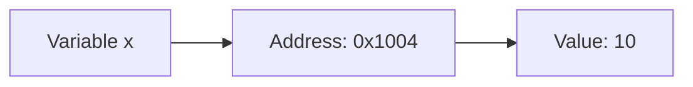

## Example 01 – Address Operator

File: `examples/01_address_operator.c`

```c
int x = 10;

printf("x  = %d\n", x);
printf("&x = %p\n", (void *)&x);
```

Compile and run:

```bash
gcc examples/01_address_operator.c -o ex01
./ex01
```

---

# 2. What Is a Pointer?

A pointer is:

> **A variable that stores a memory address.**

```c
int x = 10;
int *p = &x;
```

Here:

- `x` stores `10`.
- `&x` means "the address of x".
- `p` stores that address.
- `*p` means "the value stored at the address inside p".

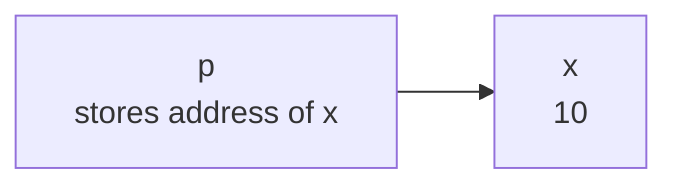

## Example 02 – Basic Pointer

File: `examples/02_basic_pointer.c`

This example prints:

- `x`
- `&x`
- `p`
- `*p`
- `&p`

Key relationships:

```text
p == &x
*p == x
```

---

# 3. The Two Meanings of `*`

## Pointer declaration

```c
int *p;
```

This means:

> `p` is a pointer to an integer.

## Dereferencing

```c
*p
```

This means:

> Access the integer stored at the address currently contained in `p`.

---

# 4. Modifying a Variable Through a Pointer

```c
int x = 10;
int *p = &x;

*p = 50;
```

After the assignment:

```text
x = 50
```

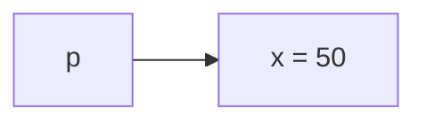

## Example 03 – Modify Through Pointer

File: `examples/03_modify_through_pointer.c`

This is one of the most important concepts in the lesson:

> Dereferencing a pointer allows us to modify the original object.

---

# Information Note – What Happens in Memory When a Function Is Called?

A function call is not merely a jump to another block of source code.

At runtime, the program needs to keep information related to the active function call.

A simplified model uses the **call stack**.

Suppose:

```c
int main(void) {
    int number = 10;
    change(number);
}
```

and:

```c
void change(int x) {
    x = 100;
}
```

Conceptually, we can imagine separate stack frames:

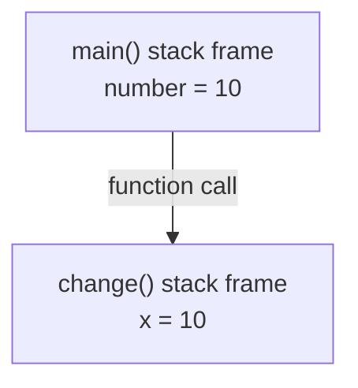

The exact machine-level implementation depends on the platform, compiler, optimization level, and calling convention.

But the conceptual rule is extremely useful:

> Each function call has its own execution context and its own local variables.

When `change(number)` is called, the value `10` is used to initialize the parameter `x`.

`x` is therefore a separate object from `number`.

Changing:

```c
x = 100;
```

changes `x`, not `number`.

---

# Information Note – Why Does C Pass a Copy of the Variable?

Students often ask:

> "Why does the function receive a copy? Why does it not automatically receive the original variable?"

Because C function parameters are defined using **pass-by-value semantics**.

Consider:

```c
void change(int x);
```

The parameter is an `int`.

The caller therefore supplies an `int` value.

```c
change(number);
```

If:

```c
number == 10
```

then the called function receives the value `10`.

Conceptually:

```text
main:
number = 10

change:
x = 10
```

They contain the same value initially, but they are different objects.

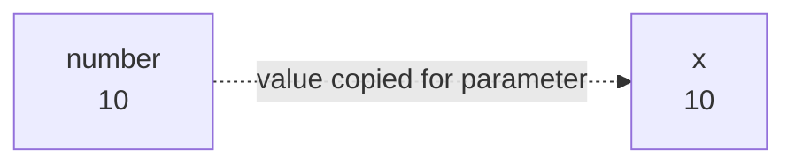

This behavior is useful because a function can work with a parameter without automatically modifying the caller's variable.

For example:

```c
int square(int x) {
    return x * x;
}
```

Calling:

```c
int a = 5;
int result = square(a);
```

should normally not destroy or replace `a`.

The function receives the value it needs to perform its work.

---

# Information Note – Then How Can a Function Modify the Original Variable?

C still passes by value when we use pointers.

This is a subtle but very important statement.

Consider:

```c
void change(int *p) {
    *p = 100;
}
```

and:

```c
change(&number);
```

C is **still passing by value**.

What gets copied this time?

Not the integer `number`.

The value being passed is:

```text
the address of number
```

Conceptually:

```text
main:
number = 10
address of number = 0x1000

change:
p = 0x1000
```

So `p` itself is still a local parameter containing a copied value.

But the copied value happens to be an address that points to the original object.

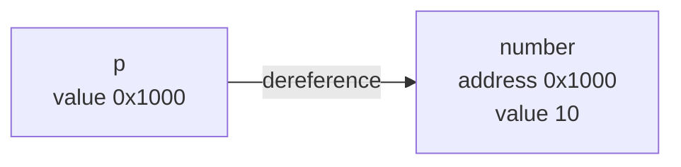

Therefore:

```c
*p = 100;
```

means:

> Go to address `0x1000` and modify the value stored there.

That modifies `number`.

This is why saying:

> "C passes pointers by reference"

is imprecise.

A better statement is:

> **C always passes arguments by value. A pointer lets us pass the value of an address, which gives the called function access to the original object.**

---

# Information Note – Function Call: Source Code vs CPU Reality

In source code:

```c
change(&number);
```

looks like a simple function call.

At machine level, the compiler may generate instructions that:

1. prepare the argument,
2. store the return location,
3. transfer control to the function,
4. create or adjust a stack frame,
5. execute the function body,
6. restore the previous execution context,
7. continue after the call.

The exact process depends on the architecture and ABI/calling convention.

For teaching purposes, the most important model is:

```text
caller
  ↓
prepare argument values
  ↓
function receives its own parameters
  ↓
function executes
  ↓
return to caller
```

---

# 5. Why Pointers Matter in Functions

C uses **pass by value**.

When a normal integer is passed to a function, a copy is passed.

## Example 04 – Pass by Value

File: `examples/04_pass_by_value.c`

```c
void change(int x) {
    x = 100;
}
```

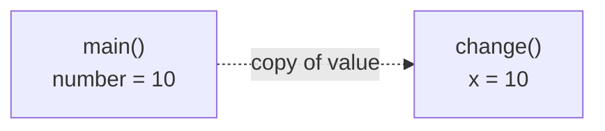

Changing `x` does not change `number`.

---

# 6. Passing an Address to a Function

Instead of copying the integer, we can pass its address.

```c
void change(int *p) {
    *p = 100;
}
```

Call:

```c
change(&number);
```

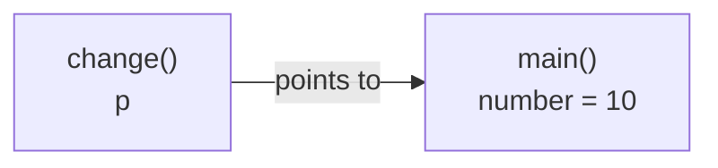

Now the function can modify the original variable.

## Example 05 – Pass Pointer to Function

File: `examples/05_pass_pointer_to_function.c`

---

# 7. The Classic Pointer Example: Swap

A normal swap function cannot modify its caller's integers if it receives only copies.

Pointers solve the problem.

```c
void swap(int *a, int *b) {
    int temp = *a;
    *a = *b;
    *b = temp;
}
```

## Example 06 – Swap with Pointers

File: `examples/06_swap_with_pointers.c`

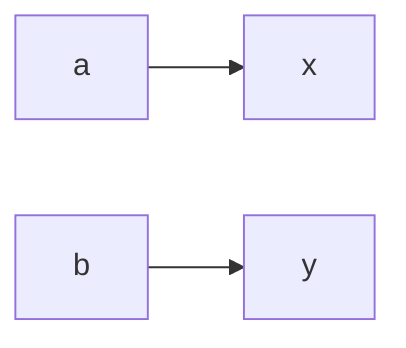

This pattern will appear repeatedly in Data Structures.

---

# 8. Arrays and Pointers

Consider:

```c
int numbers[5] = {10, 20, 30, 40, 50};
```

Conceptually:

```text
Address     Value
0x1000      10
0x1004      20
0x1008      30
0x100C      40
0x1010      50
```

The array name usually decays to a pointer to its first element.

```text
numbers == &numbers[0]
```

## Example 07 – Array Addresses

File: `examples/07_array_addresses.c`

The program prints each element's address so students can observe the memory layout.

---

# 9. Pointer Arithmetic

If `p` is an `int *`, then:

```c
p + 1
```

moves to the next `int`, not merely one byte.

For a typical system where `sizeof(int) == 4`:

```text
p      -> 0x1000
p + 1  -> 0x1004
p + 2  -> 0x1008
```

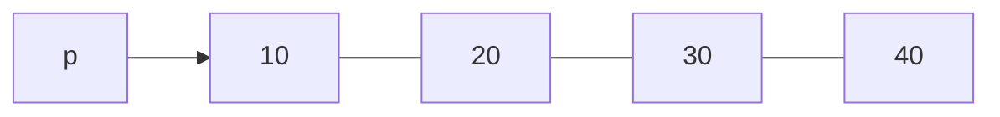

## Example 08 – Pointer Arithmetic

File: `examples/08_pointer_arithmetic.c`

---

# 10. Array Indexing Is Closely Related to Pointer Arithmetic

In C:

```c
numbers[i]
```

is equivalent in meaning to:

```c
*(numbers + i)
```

## Example 09 – Array Index vs Pointer Arithmetic

File: `examples/09_array_index_vs_pointer.c`

---

# 11. Incrementing a Pointer

```c
int *p = numbers;

printf("%d\n", *p);
p++;
printf("%d\n", *p);
```

`p++` advances the pointer to the next element of its pointed-to type.

## Example 10 – Pointer Increment

File: `examples/10_pointer_increment.c`

This example prints both the address and the value at each step.

---

# 12. `sizeof` and Pointer Size

Common sizes on many systems are:

```text
char   = 1 byte
int    = 4 bytes
double = 8 bytes
```

But exact sizes are platform-dependent.

Pointer sizes are determined mainly by the architecture.

On many 64-bit systems:

```text
sizeof(int *)    = 8
sizeof(char *)   = 8
sizeof(double *) = 8
```

## Example 11 – Type and Pointer Sizes

File: `examples/11_sizeof_types_and_pointers.c`

---

# 13. Passing Arrays to Functions

These parameter forms are equivalent for a function parameter:

```c
void printArray(int arr[], int size);
```

and:

```c
void printArray(int *arr, int size);
```

## Example 12 – Array to Function

File: `examples/12_array_to_function.c`

---

# 14. Modifying an Array Inside a Function

Because a function receives access to the array's elements through an address, it can modify the original array.

```c
void doubleValues(int *arr, int size) {
    for (int i = 0; i < size; i++) {
        arr[i] *= 2;
    }
}
```

## Example 13 – Modify Array in Function

File: `examples/13_modify_array_in_function.c`

---

# 15. Strings and Pointers

A C string is a `char` array terminated by:

```c
'\0'
```

Example:

```c
char name[] = "Hello";
```

Conceptually:

```text
H e l l o \0
```

A pointer can traverse the characters:

```c
char *p = name;

while (*p != '\0') {
    printf("%c\n", *p);
    p++;
}
```

## Example 14 – String Traversal with Pointer

File: `examples/14_string_with_pointer.c`

---

# 16. NULL Pointers

A pointer that currently points to no valid object can be initialized as:

```c
int *p = NULL;
```

Always avoid dereferencing a NULL pointer.

```c
if (p != NULL) {
    printf("%d\n", *p);
}
```

## Example 15 – NULL Pointer Check

File: `examples/15_null_pointer_check.c`

---

# 17. Wild, NULL, and Dangling Pointers

## Wild Pointer

```c
int *p;
```

The pointer has not been initialized.

## NULL Pointer

```c
int *p = NULL;
```

The pointer deliberately points to no valid object.

## Dangling Pointer

```c
int *p = malloc(sizeof *p);
free(p);
```

The pointer may still contain the old address, but the pointed-to object no longer belongs to the program.

A common defensive pattern:

```c
free(p);
p = NULL;
```

---

# 18. Pointer to Pointer

A pointer is also a variable and therefore has its own address.

```c
int x = 10;
int *p = &x;
int **pp = &p;
```

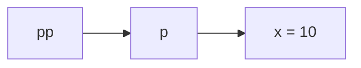

Then:

```text
x    = 10
*p   = 10
**pp = 10
```

## Example 16 – Double Pointer

File: `examples/16_double_pointer.c`

Double pointers become important when:

- a function must modify a pointer,
- implementing linked lists,
- working with dynamic 2D structures,
- managing pointer-based trees.

---

# Information Note – Is Memory Really Divided Exactly Like the Diagram?

You will often see diagrams such as:

```text
Code
Data
Heap
Stack
```

These are useful conceptual models, but do not treat them as a literal universal physical map.

Modern operating systems provide each process with a **virtual address space**.

The operating system and hardware cooperate to map virtual addresses to physical memory.

A simplified process memory layout may contain regions for:

- executable code,
- read-only constants,
- global/static data,
- dynamically allocated memory,
- shared libraries,
- mapped files,
- thread stacks.

So when we say:

> "`x` is on the stack"

or:

> "`malloc` allocates from the heap"

we are using a useful programming model.

The exact layout depends on the operating system, compiler, architecture, executable format, runtime libraries, and optimizations.

---

# Information Note – Automatic Storage and Lifetime

Consider:

```c
void test(void) {
    int x = 10;
}
```

`x` is a local variable with **automatic storage duration**.

Its lifetime begins when execution enters the relevant block and ends when execution leaves it.

This is why returning:

```c
return &x;
```

is wrong.

The address may still look like a number after the function returns, but the object `x` no longer exists.

Pointer correctness is therefore not only about:

> "Does this pointer contain an address?"

It is also about:

> **"Is there still a valid object at that address?"**

---

# 19. Stack and Heap

A simplified memory model:

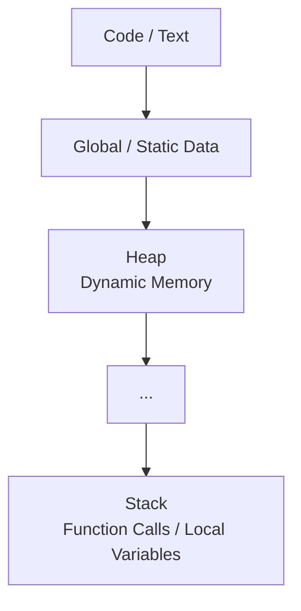

Local automatic variables typically have automatic storage duration associated with function execution.

Dynamic allocation is performed from the heap using functions such as:

```c
malloc()
calloc()
realloc()
free()
```

Include:

```c
#include <stdlib.h>
```

---

# 20. `malloc()`

`malloc()` allocates a requested number of bytes.

```c
int *p = malloc(sizeof *p);
```

Always check the result:

```c
if (p == NULL) {
    return 1;
}
```

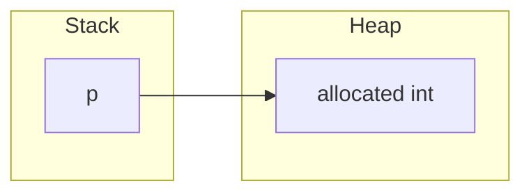

## Example 17 – Allocate One Integer

File: `examples/17_malloc_single_int.c`

---

# 21. Dynamic Arrays

If the number of elements is not known at compile time, we can allocate memory at runtime.

```c
int *numbers = malloc(n * sizeof *numbers);
```

## Example 18 – Dynamic Array with `malloc`

File: `examples/18_dynamic_array_malloc.c`

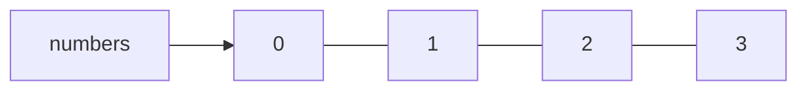

---

# 22. `calloc()`

`calloc()` allocates memory and zero-initializes the allocated bytes.

```c
int *numbers = calloc(5, sizeof *numbers);
```

## Example 19 – `calloc`

File: `examples/19_calloc.c`

---

# 23. `realloc()`

`realloc()` changes the size of an existing dynamic allocation.

Safe pattern:

```c
int *temp = realloc(numbers, newSize * sizeof *numbers);

if (temp != NULL) {
    numbers = temp;
}
```

Do not immediately overwrite your only pointer unless you deliberately handle failure.

## Example 20 – `realloc`

File: `examples/20_realloc.c`

---

# 24. `free()`, Memory Leaks, and Use-After-Free

When memory is no longer needed:

```c
free(pointer);
```

A **memory leak** occurs when dynamically allocated memory becomes unreachable without being released.

A **use-after-free** bug occurs when code accesses memory after it has been freed.

Wrong:

```c
free(p);
*p = 20;
```

Better:

```c
free(p);
p = NULL;
```

---

# 25. Struct Pointers

Example struct:

```c
struct Student {
    int id;
    float grade;
};
```

Pointer:

```c
struct Student student;
struct Student *p = &student;
```

The following are equivalent:

```c
(*p).id
```

```c
p->id
```

## Example 21 – Struct Pointer and `->`

File: `examples/21_struct_pointer.c`

---

# 26. From Pointers to Linked Lists

A node can store both data and the address of another node:

```c
struct Node {
    int data;
    struct Node *next;
};
```

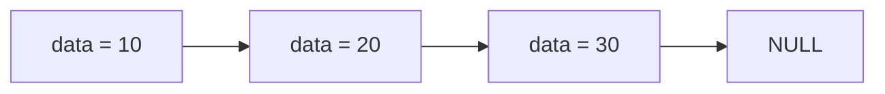

This is the foundation of a **Singly Linked List**.

---

# 27. Creating Linked List Nodes

## Example 22 – Two Linked Nodes

File: `examples/22_linked_list_two_nodes.c`

The target structure is:

```text
head
 |
 v
+----+------+     +----+------+
| 10 | next | --> | 20 | NULL |
+----+------+     +----+------+
```

---

# 28. Traversing a Linked List

Unlike an array, a linked list does not require contiguous nodes.

We follow addresses:

```c
struct Node *current = head;

while (current != NULL) {
    printf("%d\n", current->data);
    current = current->next;
}
```

## Example 23 – Linked List Traversal

File: `examples/23_linked_list_traversal.c`

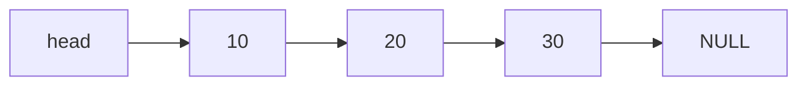

---

# 29. Arrays vs Linked Lists

## Array

```text
[10][20][30][40]
```

Typically contiguous memory.

## Linked List

```text
[10|next] --> [20|next] --> [30|NULL]
```

Nodes can reside at unrelated memory addresses.

The pointers create the logical order.

---

# 30. Trees

A Binary Tree node can contain two child pointers:

```c
struct TreeNode {
    int data;
    struct TreeNode *left;
    struct TreeNode *right;
};
```

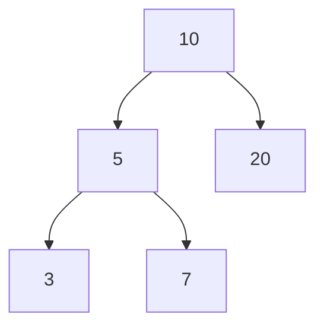

The edges in an in-memory pointer-based tree are implemented using addresses.

---

# 31. Graphs

Many Graph implementations also depend on pointer-based structures.

An adjacency-list representation may conceptually look like:

```text
A -> B -> C
B -> A -> D
C -> A
D -> B
```

Pointer knowledge therefore leads directly toward:

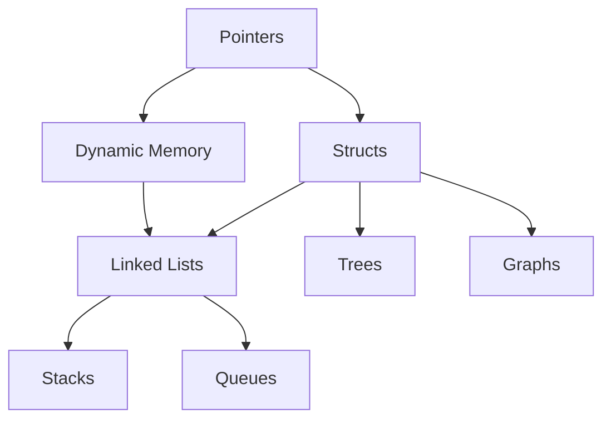

---

# 32. Returning an Address from a Function

This is wrong:

```c
int *createNumber(void) {
    int x = 10;
    return &x;
}
```

`x` is a local automatic variable. Its lifetime ends when the function returns.

A valid alternative is dynamic allocation.

## Example 24 – Find Maximum Element's Address

File: `examples/24_find_max_address.c`

This function returns the address of an element that still belongs to the caller's array.

## Example 25 – Return a Dynamically Allocated Pointer

File: `examples/25_return_dynamic_pointer.c`

The caller becomes responsible for calling `free()`.

---

# 33. Two-Pointer Algorithms

The term "two pointers" in algorithms may refer to actual pointers or indexes representing positions.

Example: reversing an array.

```text
 L           R
 ↓           ↓
[1][2][3][4][5]
```

Swap and move inward:

```text
    L     R
    ↓     ↓
[5][2][3][4][1]
```

Final:

```text
[5][4][3][2][1]
```

## Example 26 – Reverse an Array Using Pointers

File: `examples/26_reverse_array_with_pointers.c`

---

# 34. Practice Example – Increment

Write:

```c
void increment(int *number);
```

Expected behavior:

```c
int x = 10;
increment(&x);
printf("%d\n", x);
```

Output:

```text
11
```

## Example 27 – Solution

File: `examples/27_increment_exercise_solution.c`

---

# 35. Practice Example – Sum an Array

Write:

```c
int sum(const int *arr, int size);
```

Input:

```text
1 2 3 4 5
```

Expected output:

```text
15
```

## Example 28 – Solution

File: `examples/28_sum_array_with_pointer.c`

---

# 36. Practice Example – Dynamic Array Average

Requirements:

1. Read `n`.
2. Allocate `n` numbers dynamically.
3. Read the numbers.
4. Compute their average.
5. Release the memory.

## Example 29 – Solution

File: `examples/29_dynamic_array_average.c`

---

# 37. Pointer Trace Exercise

Consider:

```c
int x = 10;
int *p = &x;
int **q = &p;
```

Determine:

```text
x
&x
p
*p
&p
q
*q
**q
```

## Example 30 – Pointer Trace

File: `examples/30_pointer_trace_quiz.c`

This is particularly useful as a live classroom demonstration.

---

# 38. Common Errors

## Error 1 – Uninitialized Pointer

Wrong:

```c
int *p;
*p = 50;
```

The pointer does not yet point to a valid object.

## Error 2 – NULL Dereference

Wrong:

```c
int *p = NULL;
*p = 10;
```

## Error 3 – Use-After-Free

Wrong:

```c
free(p);
printf("%d\n", *p);
```

## Error 4 – Double Free

Wrong:

```c
free(p);
free(p);
```

## Error 5 – Array Out of Bounds

```c
int numbers[5];
numbers[5] = 100;
```

Valid indexes are `0` through `4`.

---

# 39. Pointer Thinking Model

Whenever you encounter a pointer problem, ask:

1. **What address does the pointer store?**
2. **What value is stored at that address?**
3. **What is the pointer's type?**
4. **Is the pointed-to object still valid?**

Check:

```text
NULL?
freed?
out of scope?
outside array bounds?
```

---

# 40. Summary Table

| Syntax | Meaning |
|---|---|
| `int x` | Integer variable |
| `&x` | Address of `x` |
| `int *p` | Pointer to integer |
| `p = &x` | `p` points to `x` |
| `*p` | Value stored at the address in `p` |
| `p++` | Advance to next element of pointed-to type |
| `int **pp` | Pointer to pointer |
| `malloc()` | Allocate dynamic memory |
| `calloc()` | Allocate zero-initialized dynamic memory |
| `realloc()` | Resize dynamic memory |
| `free()` | Release dynamic memory |
| `NULL` | Pointer to no valid object |
| `p->member` | Access struct member through a pointer |

---

# 41. What Students Should Know Before Linked Lists

- [ ] Value vs memory address
- [ ] `&` operator
- [ ] Pointer declaration
- [ ] Dereference operator `*`
- [ ] Modifying an object through a pointer
- [ ] Passing addresses to functions
- [ ] Arrays and pointer arithmetic
- [ ] `NULL`
- [ ] `malloc`
- [ ] `calloc`
- [ ] `realloc`
- [ ] `free`
- [ ] Structs
- [ ] Struct pointers
- [ ] `->`

Once these are understood, students are ready for a full **Singly Linked List** lesson.

---

# 42. Mini Build Demonstration – Show the Compiler Pipeline in Class

Use the following tiny program:

```c
#include <stdio.h>

int add(int a, int b);

int main(void) {
    int result = add(10, 20);
    printf("%d\n", result);
    return 0;
}

int add(int a, int b) {
    return a + b;
}
```

Save it as:

```text
compiler_demo.c
```

Normal build:

```bash
gcc compiler_demo.c -o compiler_demo
```

You can also show the stages separately.

## Preprocessing

```bash
gcc -E compiler_demo.c -o compiler_demo.i
```

## Compile to assembly

```bash
gcc -S compiler_demo.c -o compiler_demo.s
```

## Compile to object file

```bash
gcc -c compiler_demo.c -o compiler_demo.o
```

## Link object file

```bash
gcc compiler_demo.o -o compiler_demo
```

This gives students a concrete view of:

```text
.c
↓
.i
↓
.s
↓
.o
↓
executable
```

> [!note]
> Exact output and intermediate details vary by compiler and platform.

---

# 43. Mental Model: What Happens When We Run a Pointer Program?

Suppose:

```c
int main(void) {
    int x = 10;
    int *p = &x;
    *p = 20;
}
```

A useful conceptual sequence is:

```mermaid
flowchart TD
    C["Compiler translates source code"]
    E["Executable starts"]
    F["main() execution context created"]
    X["Storage for x exists<br/>x = 10"]
    P["Storage for p exists<br/>p receives address of x"]
    D["*p dereferences that address"]
    W["20 is written into x"]
    R["main() returns"]

    C --> E
    E --> F
    F --> X
    X --> P
    P --> D
    D --> W
    W --> R
```

This connects four topics that are often taught separately:

```text
Compiler
+
Memory
+
Function execution
+
Pointers
```

Understanding their relationship makes Data Structures much easier.

---

# 44. End-of-Lesson Questions

1. What is a pointer?
2. What is the difference between `x` and `&x`?
3. What is the difference between `p`, `*p`, and `&p`?
4. Why does a normal `swap(int a, int b)` not modify the caller's variables?
5. Why does `swap(int *a, int *b)` work?
6. What does `p + 1` mean?
7. Why is `arr[i]` closely related to `*(arr + i)`?
8. What is a NULL pointer?
9. What is a wild pointer?
10. What is a dangling pointer?
11. What is a memory leak?
12. What does `malloc()` return?
13. Why must `malloc()` be checked for failure?
14. What does `free()` do?
15. What does `p->data` mean?
16. What does `struct Node *next` mean?
17. Why are pointers fundamental to Linked Lists?
18. How do pointers support Trees?
19. What is a double pointer?
20. Why must you not return the address of an ordinary local variable?

---

# 45. Big Picture

```mermaid
flowchart TD
    M["Memory"]
    A["Address"]
    P["Pointer"]
    AR["Arrays"]
    DM["Dynamic Memory"]
    N["Node"]
    LL["Linked List"]
    SQ["Stack / Queue"]
    T["Tree"]
    G["Graph"]

    M --> A
    A --> P
    P --> AR
    P --> DM
    DM --> N
    P --> N
    N --> LL
    LL --> SQ
    N --> T
    N --> G
```

> [!important]
> The core idea of pointers is simple:
>
> **A pointer stores the location of another object in memory.**
>
> Once this is understood, many data structures become much easier to understand.

Linked List:

```text
A node knows where the next node is.
```

Tree:

```text
A node knows where its child nodes are.
```

Graph:

```text
A vertex representation can know where its connected structures are.
```

The conceptual progression is:

```text
Memory
  ↓
Address
  ↓
Pointer
  ↓
Dynamic Memory + Struct
  ↓
Node
  ↓
Data Structures
```
